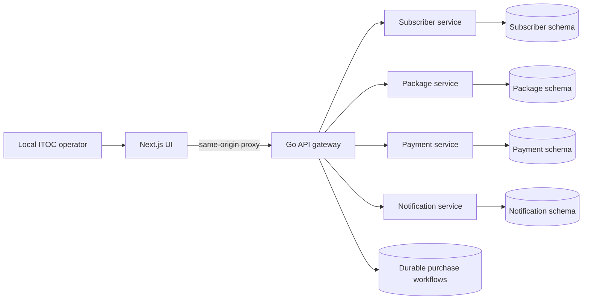
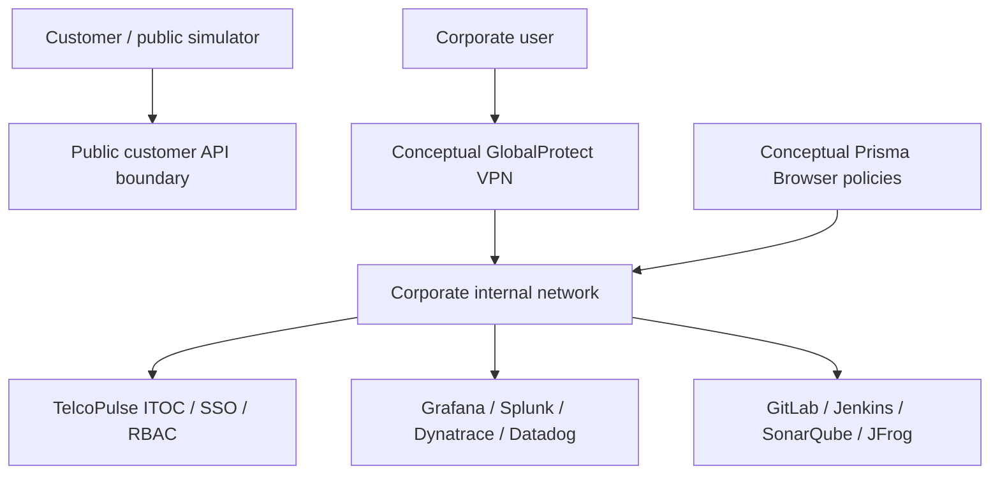

# Architecture

## Current service architecture

Services are separate processes/containers with authenticated, deadline-bounded HTTP calls. Local development shares a PostgreSQL instance with owned schemas. See [consistency and recovery](architecture/service-evolution.md) for reserve/confirm/release behavior, migration from the foundation, and verified fault cases. Stored correlation IDs are not yet exported OpenTelemetry spans.

## Target corporate access boundary

GlobalProtect and Prisma Browser are conceptual boundaries only. Local development requires neither proprietary product. Compose exposes only loopback frontend access; internal services have no host ports. No real corporate addresses, credentials or topology are used.

## Target tool responsibilities

- OpenTelemetry: vendor-neutral HTTP/database/Kafka context propagation.
- Prometheus and Grafana: metrics, business SLIs, trends and alert detection.
- Splunk: structured logs and business transaction investigation.
- Dynatrace: APM, trace dependency and service flow investigation.
- Datadog: optional read-only pod restart, memory and CPU context for incident investigation; live vendor and cluster validation remain pending.
- Kafka: durable asynchronous transaction/payment/notification events, retries and observable lag.
- GitLab CI: verification, quality gate, image and artifact creation.
- Jenkins: deployment, environment promotion, smoke checks and rollback.

These target components must be implemented and verified incrementally; their names here are not evidence of a running integration.
